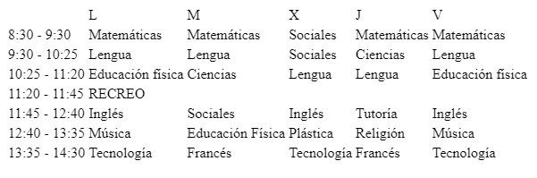
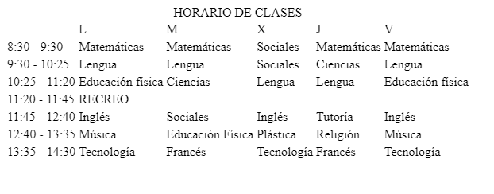
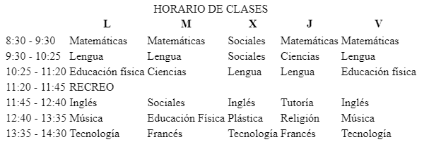

# TABLAS
<ul>
    <li ><a href="#etiquetas">ETIQUETAS</a></li>
    <li><a href="#atributos">ATRIBUTOS</a></li>
</ul>


Las tablas en HTML sirven para mostrar un contenido compacto, estructurado, o TABULADO.
Ejemplo:


La estructura básica de una tabla se compone de tres etiquetas:
**table -> Etiqueta que encierra la tabla
tr -> table row, construye una fila
td -> table data, construye una celda**

> Truco
> El número de celdas dentro de un tr establecerá el número de columnas de la tabla.

Ejemplo en HTML
```html
<table>
    <tr>
        <td></td>
        <td>L</td>
        <td>M</td>
        <td>X</td>
        <td>J</td>
        <td>V</td>
    </tr>
    <tr>
        <td>8:30 - 9:30</td>
        <td>Matemáticas</td>
        <td>Matemáticas</td>
        <td>Sociales</td>
        <td>Matemáticas</td>
        <td>Matemáticas</td>
    </tr>
    <tr>
        <td>9:30 - 10:25</td>
        <td>Lengua</td>
        <td>Lengua</td>
        <td>Sociales</td>
        <td>Ciencias</td>
        <td>Lengua</td>
    </tr>
    <tr>
        <td>10:25 - 11:20</td>
        <td>Educación física</td>
        <td>Ciencias</td>
        <td>Lengua</td>
        <td>Lengua</td>
        <td>Educación física</td>
    </tr>
    <tr>
        <td>11:20 - 11:45</td>
        <td>RECREO</td>
    <tr>
        <td>11:45 - 12:40</td>
        <td>Inglés</td>
        <td>Sociales</td>
        <td>Inglés</td>
        <td>Tutoría</td>
        <td>Inglés</td>
    </tr>
    <tr>
        <td>12:40 - 13:35</td>
        <td>Música</td>
        <td>Educación Física</td>
        <td>Plástica</td>
        <td>Religión</td>
        <td>Música</td>
    </tr>
    <tr>
        <td>13:35 - 14:30</td>
        <td>Tecnología</td>
        <td>Francés</td>
        <td>Tecnología</td>
        <td>Francés</td>
        <td>Tecnología</td>
    </tr>
</table>
```

Y asi quedaría en la web:


<h2 i="etiquetas"> ETIQUETAS DE LA TABLA</h2>

### CAPTION
Para establecer un título a la tabla, se utiliza la etiqueta:

```html
<caption>
```
Es una etiqueta opcional, normalmente de ubica después de la etiqueta de la tabla
Ejemplo:
```html
<table>
    <caption>HORARIO DE CLASES</caption>
    <tr>
    </tr>
</table>
```



### THEAD

Para que nuestro horario tenga una cabezera, se establece con la etiqueta
```html
    <thead></thead>
```
Dentro de esta, tendremos la etiqueta tr normal, pero también, la etiqueta td se remplaza por la
```html
    <th></th>
```

Ejemplo:
```html
    <table>
    <thead>
        <tr>
            <th></th>
            <th>L</th>
            <th>M</th>
            <th>X</th>
            <th>J</th>
            <th>V</th>
        </tr>
        <tr>
    </thead>
```


### TBODY
Esta etiqueta es opcional, **siempre y cuando**, no este presente un thead. Si este no es el caso, osea hay un thead, es necesario poner el tbody para todo el contenido de la tabla.
```html
<tbody></tbody>
```

### TFOOT

Esta si es 100% opcional si estas trabajando con la semantica de la información en bloques. Esta etiqueta pone un pie de página a la tabla.

```html
    <tfoot></tfoot>
```

<h2 id="atributos">ATRIBUTOS</h2>
Para hacer que las celdas ocupen más de una fila o más de una columna, poseemos 2 atributos:

### ROWSPAN
Sirve para que una celda ocupe más de una fila, el valor por defecto es 1
```html
    <td rowspan="2">Papu</td>
```

### COLSPAN
Sirve para que la celda ocupe más de una columna, su valor por defecto es 1.
```html
    <td colspan="2">Videollamada</td>
```

<h2 id="columnas">COLUMNAS</h2>

Cuando necesitemos seleccionar una columna, tenemos la etiqueta
```html 
<colgroup></colgroup>
```
Que nos permite seleccionar una columna en concreto. Debemos poner tantas etiquetas
```html
    <col>
```
como columnas tengamos, cada una de estas equivaldrá a una columna siguiendo el mismo orden que tiene la tabla.

Si necesitamos que una etiqueta col agrupe más de una columna, tenemos el atributo
```html
    <col span="2">
```
Funciona igual que las etiquetas de rowspan o colspan.

